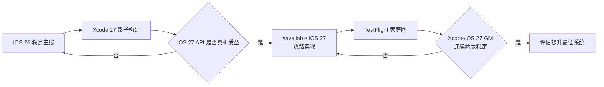
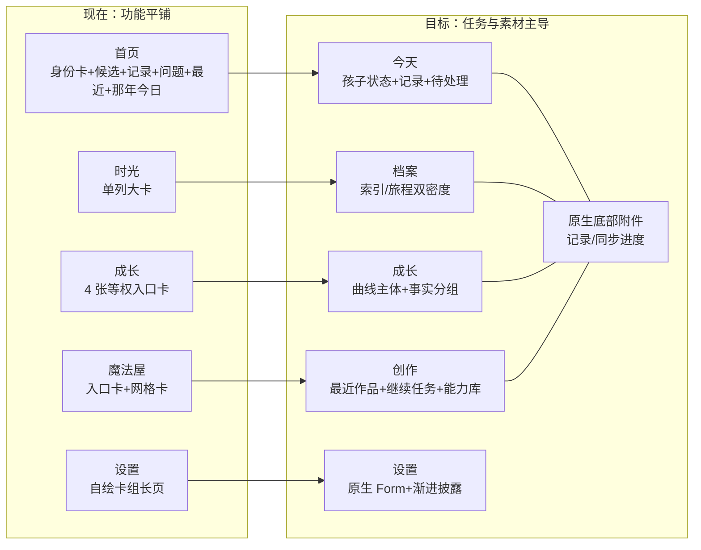
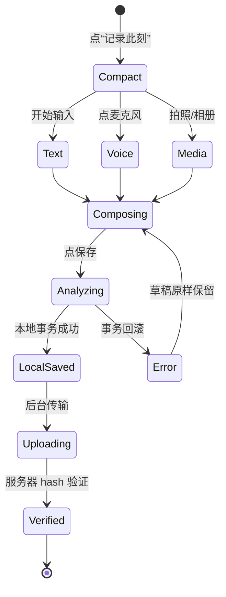
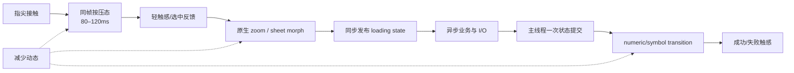
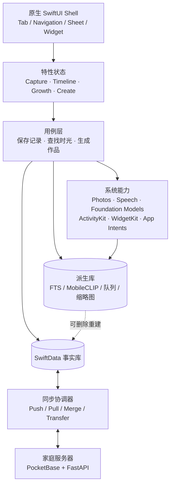

# 布布时光机 iOS 下一轮高级升级计划

> 版本：Plan 1.0
> 日期：2026-08-29
> 基线：`main` / `origin/main` @ `794a55d` / iOS 2.11.0
> 范围：iPhone 主产品 + iPadOS 一等适配；Mac Catalyst/watchOS 不扩建。
> 状态：已进入工程落地；iOS 26 正式路径持续验证，iOS 27 走 Xcode 27 shadow build 门禁。

---

## 0. 一页结论

布布时光机已经不是 MVP，而是一个具备离线事实库、照片后台上传、双向同步、加密胶囊、Widget、Live Activity、App Intents、手表和自托管 AI 的完整产品。下一轮不应继续堆页面，而应做三件事：

1. **产品收敛**：首页、记录、时光、成长、魔法屋各自只承担一个主任务，不再把能力平铺成等权卡片。
2. **体感升级**：用真实照片、时间、声音取代大面积装饰渐变；用 iOS 26 原生 Tab/底部附件/转场取代自绘壳层。
3. **工程变瘦**：先删已确认死码，再合并重复卡片、动效和同步样板；不用 TCA/Realm 等大重写换取“架构看起来更新”。

### 已落地（2.12.0 第一批）

- iOS 26 原生 Tab、滚动收缩、记录 bottom accessory；iPad 改为 `sidebarAdaptable`。
- iPhone 首页完整证件卡收成 Living Cover；iPad 宽屏保留完整身份卡；移除遮挡业务的 AI 悬浮球。
- 首页全量 Entry 查询改为最近 12 条 + SQLite COUNT/日期范围查询。
- SpeechAnalyzer/SpeechTranscriber 成为端侧转写主路径，旧识别器与家庭 Whisper 继续兜底。
- 时光成为隐私可控的 `IndexedEntity`，Spotlight 可按文字检索并通过具体 UUID deep link 打开旧记录。
- iPad Widget target 开放；记录/设置/魔法屋/成长使用内容列或 adaptive grid。
- 新增 XCUITest target，覆盖 iPhone/iPad 根导航、记录、时光搜索和 iPad 横屏。
- 删除旧自绘底栏、旧时光卡、Mesh Hero、未使用计数/星座/骨架和页面死码。

### iOS 27 复审结论（2026-08-29）

> 复审环境：iOS 27 beta 7 / Xcode 27 beta 6 已由 Apple 发布；当前开发机只有 Xcode 26.6 + iOS 26.5 Simulator，因此 iOS 27 结论来自 WWDC26/Apple Developer 一手资料，**尚未在本机编译验证**。

总体判断：原计划约 **80% 仍然合理**，但应调整以下 20%：

| 原计划 | iOS 27 判断 | 调整 |
|---|---|---|
| 原生 Tab + 可收缩底栏 | 仍然正确 | 保留；iOS 27 再加 toolbar `visibilityPriority`、overflow menu、pinned placement |
| Nuke 远程图 POC | 优先级下降 | 先用 iOS 27 `AsyncImage(request:) + asyncImageURLSession`、系统 HTTP cache；仅在指标仍不达标时测 Nuke |
| FTS/Core Spotlight 文本搜索 | 方向正确但能力太保守 | 用 `IndexedEntity` + Spotlight 语义索引；大数据用 `EntityStringQuery/IntentValueQuery` |
| Foundation Models 端侧降级 | 需要升级为统一模型路由 | 利用 `LanguageModel`、端侧/PCC/自托管 provider、Dynamic Profiles、Spotlight SearchTool、Evaluations；但保留产品域 `AIService` |
| SwiftData 限量查询 | 仍然正确 | 视图外派生状态优先用 iOS 27 `ResultsObserver`；同步/索引/Widget 反应用 `HistoryObserver` |
| iPhone-only 后删自适应代码 | **不再合理** | iOS 27 的 iPhone App 也可调整尺寸，必须保留宽度自适应；只删真正专属 iPad/Mac 的业务页 |
| 全 App 改为 Document App | 不合理 | 布布不是文档编辑器；新 Document API 仅评估用于“开放档案检查/恢复”独立流程 |

#### iOS 27 采纳策略



- 当前不把 deployment target 从 iOS 26 升到 27。
- 安装 Xcode 27 后先做影子构建/模拟器截图，不直接修复“Beta 观感”。
- 新 API 用 `#available(iOS 27, *)` 双路落地；iOS 26 继续是稳定回退。
- 只有 Xcode 27 GM、iOS 27 GM、家庭真机两个 TestFlight 版本全绿后，才评估提升最低版本。

### 本轮建议主题

**一本会生长的家庭档案**

- 真实照片是纸张。
- 时间与声音是装订线。
- 粉色/马卡龙只是索引色和仪式色，不再是每个容器的底色。
- 布布吉祥物用在引导、空状态和里程碑，不与真实照片争夺主角。

---

## 1. 最新代码基线证明

### 1.1 Git 状态

| 项目 | 结果 |
|---|---|
| 当前分支 | `main` |
| 本地 HEAD | `794a55d05a4866321c4a9b395755237af29dbb17` |
| `origin/main` | `794a55d05a4866321c4a9b395755237af29dbb17` |
| ahead / behind | `0 / 0` |
| 远端未合并分支 | 两个分支均比 main 落后 233+提交，没有 main 之外的新提交 |
| 工作树 | 代码干净；仅有未提交的 GitHub 调研 Markdown |

### 1.2 工程与测试

| 项目 | 当前证据 |
|---|---|
| 产品版本 | 2.11.0 |
| iOS 最低版本 | iOS 26.0；Photos 后台上传扩展 26.1 |
| Swift | Swift 6，严格并发，默认 MainActor |
| 主 App Swift | 184 个文件，约 40,970 行 |
| 全工程 Swift | 223 个文件，约 47,782 行 |
| 第三方 SPM 依赖 | 0（当前主工程保持原生） |
| 模拟器构建 | iPhone 17 Pro / iOS 26.5，`BUILD SUCCEEDED`，0 warning |
| 单元测试 | 150 项 / 25 套件，0 失败、0 跳过 |
| UI Test | 无 XCUITest target；只有 `-uitest-*` 直达视觉探针 |
| 视觉基线 | 已实跑 8 个路由截图：首页/时光/记录/成长/魔法屋/设置/胶囊/声音年轮 |

### 1.3 现有高级系统能力

已有，不应重复造轮子：

- SwiftData 版本化 Schema、迁移与数据保护模式。
- PhotoKit ExtensionKit 后台照片上传。
- WidgetKit 六类 Widget、Control Widget、ActivityKit Live Activity。
- App Intents、Action Button/控制中心入口、深链。
- TipKit 渐进引导。
- iOS 26 Liquid Glass、`navigationTransition(.zoom)`、`matchedTransitionSource`、`scrollTransition`、`symbolEffect`、触觉反馈。
- Vision 图片分析/人脸特征、Speech 转写、MapKit 地名。
- 自托管 PocketBase/FastAPI、SSE、原片/缩略图分层、开放档案、E2E 胶囊。

---

## 2. 当前产品判断

### 2.1 产品真相

| 维度 | 事实 |
|---|---|
| 机制 | 把孩子的照片、视频、语音、文字、成长和家庭补充变成可长期读取的家庭档案 |
| 场景 | 家长在拍完、说完、陪伴后用几秒留下；数年后按时间、声音和成长线索回看 |
| 主要改变 | 记录不丢、不用手工整理、家人能合流，18/30 年后仍能打开 |
| 设计材料 | 真实照片、声音波形、年龄、日期、地点、成长曲线、家人文字，而不是通用插画卡 |
| 行业俗套 | 育儿 App 常做成渐变+卡片+幼儿 emoji 仪表盘；照片 App 又常只有无情感的网格 |

### 2.2 Leo UI 原创性门槛现状

| 维度 | 得分 | 证据 |
|---|---:|---|
| 产品特异性 | 2/2 | 布布身份卡、真实家庭语料、声音年轮和时间胶囊无法直接换 Logo |
| 层级 | 1/2 | 首页与魔法屋有太多等权卡片，一屏内主任务不够唯一 |
| 构图 | 1/2 | 结构清晰，但长页靠“一张卡+一张卡”堆叠，尺度变化不足 |
| 材质与资产 | 2/2 | 已有布布专属吉祥物和真实照片管线 |
| 字体与色彩 | 1/2 | 温暖且可读，但马卡龙/玻璃/大标题出现太频繁，视觉空间缺少安静层 |
| 交互与动效 | 1/2 | 已有原生 zoom/symbol/haptic，但 50 处动效仍绕过统一 token，且入场+滚动转场可能叠加 |
| 可实现性 | 2/2 | 原生 iOS 26 工程与测试已稳定 |
| **合计** | **10/14 · HOLD** | 距离“高级且不臃”的 11/14 门槛只差一分，应做收敛而不是叠加 |

---

## 3. 新的设计方向合同

### 3.1 访客模式

- 主模式：`Operate`（几秒记录、快速回看、知道是否已经安全归档）。
- 次模式：`Experience`（里程碑、胶囊、绘本、声音和成长电影）。
- 规则：日常页安静，只在真正的家庭仪式时进入高表现动效。

### 3.2 方向合同

| 项目 | 决策 |
|---|---|
| 概念脊柱 | “一本会生长的家庭档案” |
| 首屏第一读 | 孩子当下状态+今天的记录动作，而不是巨大身份卡 |
| 空间原则 | 每屏一个主体、一个主动作、一个状态反馈；先用留白/对齐，再用卡片 |
| 材质 | 温暖纸面+真实照片；Liquid Glass 只留在导航、底部附件和系统弹层 |
| 字体 | 保留系统字体；大标题只用于一级入口，数据/时间用紧凑数字角色，正文回到 17pt 阅读尺度 |
| 色彩 | 暖中性背景 70%，真实照片 20%，粉/马卡龙状态索引 10% |
| 产品签名 | “记录放入档案”转场：从底部记录附件生长为编辑器，保存后缩成时光卡 |
| 动效语法 | 日常为“纸张就位”，仪式为“时间展开”；动效为状态服务，不为卡片装饰 |
| 明确反默认 | 不做幼儿 App 九宫格；不做玻璃无处不在；不用 emoji 作正式功能图标 |

---

## 4. 信息架构升级

### 4.1 现状与目标



### 4.2 底部导航

当前的 `BubuGlassTabBar` 漂亮，但也带来三个成本：

- 手工预留 92/150pt 底部空间。
- 巨大中央记录键与页面浮动 AI 键争抢。
- 内容滚动时导航不会自然收起，时光轴可视区被永久占用。

目标：

```swift
TabView { ... }
    .tabBarMinimizeBehavior(.onScrollDown)
    .tabViewBottomAccessory {
        // 默认：“记录此刻”
        // 有上传：显示原片进度
        // 有录音：显示录音时长
    }
```

- 优先使用 iOS 26 原生 Liquid Glass Tab，不再自画一个类 TabBar。
- 把中央“记录”变为系统 `tabViewBottomAccessory`：它能随 Tab 收缩，也能承载上传/录音状态。
- 不再在首页叠加可拖动 AI 球。自然语言记录并入记录附件的一个模式。

### 4.3 首页目标线框

```text
┌─ 8月29日  下午好，布布  同步状态 ─┐
│ [真实照片] 1岁7个月 · 第578天      │  ← 紧凑 Living Cover
└───────────────────────────┘

[记录此刻]  [今天有3张待收好]       ← 一个主动作+一个待办

今日回声
“今天她最得意的一件事是什么？”  [答一句]

最近时光
[真实照片/视频封面]  一句摘要  时间·地点

那年今日   ← 横向纸片，不再继续纵向加卡
```

保留身份卡，但将它收进点击 Living Cover 后的二级“布布档案”；首屏不再让一张证件卡占据近半屏。

### 4.4 记录器

当前 QuickCapture 依次堆叠介绍卡、AI 入口、4 个来源键、文字卡、语音卡、定位卡、心情。功能完整，但“一笔记录”被做成一张表单。

目标为一个可形变编辑器：



- 顶部不完成时不显示“灰掉的保存”与大块解释同时争抢。
- 文字是主体；照片/视频/语音作为可展开附件条。
- 地点和心情收入“更多上下文”，用户选过一次才常驻。
- 保存后立即缩成时光卡，而不是等网络成功；上传进度进入底部附件。

### 4.5 时光轴

现在的时光卡一张几乎占满一屏，适合沉浸回看，不适合日常找记录。新版提供两种不是两套页面的密度：

- **旅程模式**：大图、年龄轴、纸张转场，给“慢慢翻”。
- **索引模式**：一屏 3–5 条，缩略图+一句+日期+家人，给“快速找”。
- 搜索不再临时放开 20,000 条记录后内存扫 7 个字段。文本用派生 FTS/Core Spotlight 索引，画面用 MobileCLIP 派生向量。
- 保留当前 zoom navigation，但不同时给每个卡叠加入场+滚动缩放。

### 4.6 成长

- 首屏主体从 2×2 入口卡改为“最近生长段”：身高/体重小曲线+最近一次测量+区间说明。
- 健康、疫苗、里程碑作为事实分组，用紧凑行而不是四张等高卡。
- “第一次”成为一条沿年龄的时间线，与时光记录双向跳转。

### 4.7 魔法屋

当前是“能力商店”：问问布布+绘本+胶囊+三个分区卡。目标是“创作工作台”：

1. 顶部先显示“继续”：正在生成的电影、本周周报、最近绘本、即将开启胶囊。
2. 其次是最近作品封面，使真实结果而不是功能入口成为证明。
3. “问问布布”作为底部附件的自然语言模式，或保留一条紧凑主入口。
4. 能力列表收到后面，避免进页就要在 9 个选项间决策。

### 4.8 设置

- 回到 iOS 26 原生 `Form/List/Section`，让导航、Toggle、Picker、大字号、VoiceOver 由系统管理。
- 删掉一次性“功能搬家”大卡；已经有 TipKit，不需再存一套 BubuMovedHint 常驻提示。
- 相框模式、手表和 Mac 入口应按本轮 iPhone 范围收口：不扩建，根据真实使用决定保留或删除。
- 高级服务器配置保持二级，但应有连接测试、家庭身份和同步摘要，不显示原始 Token/密码。

---

## 5. 动效与交互语法

### 5.1 当前问题

- `BubuMotion` 注释说全 App 只允许 5 种曲线，但代码仍有约 **50 处** `.spring/.ease/.smooth/.snappy` 裸调用。
- 时光卡同时使用 `entranceEffect` 和 `scrollTransition`，同一元素可能被两套透明度/位移/缩放驱动。
- 一些列表数量变化对整页 `.animation`，容易让非相关布局一起动。
- 循环呼吸/浮动有 reduce motion，但动画触发规则分散在页面。

### 5.2 新动效预算

| 层级 | 耗时 | 用途 | 允许效果 |
|---|---:|---|---|
| Tactile | 80–120ms | 按下/选中 | 0.98 缩放+轻触感，不改布局 |
| Navigate | 260–380ms | 页面/详情 | 系统 zoom/sheet morph，不手写滑屏引擎 |
| State | 320–500ms | 上传/保存/计数 | `contentTransition(.numericText)` / symbol replacement / progress |
| Ceremony | 800–1800ms | 胶囊/里程碑/生日 | 一次性粒子+声音+触感，允许跳过 |

### 5.3 交互流



要点：

- 动效的开始状态在点击同帧同步发布；长任务之后才 `withAnimation` 会显得慢半拍。
- View 只接收可动画状态，解码、索引、hash、AI、同步不在 View 中做。
- 日常列表只保留一套入场/滚动效果；首次出现之后不再重播。
- 为动效建立截图+录屏+帧率门槛，不用“感觉更丝滑”作验收。

---

## 6. iOS 26 稳定基座 + iOS 27 渐进升级

### 6.1 原生 Tab / Liquid Glass

- 用 `tabBarMinimizeBehavior(.onScrollDown)` 让时光、成长和魔法屋滚动时自动让出空间。
- 用 `tabViewBottomAccessory` 承载记录/录音/同步状态。
- `GlassEffectContainer` 只用在需要形变关系的一组控件，不在每张内容卡上叠 glass。
- 项目最低已是 iOS 26，`BubuLiquidGlass`/`BubuGlassTabBar`/`OnDeviceNaturalParser` 内的 iOS 26 fallback 分支已不可达，应删除。

iOS 27 增量：

- 先用 Xcode 27 重建检查系统自动更新的 Liquid Glass 外观，不为了追 Beta 视觉重画一套材质。
- 使用 toolbar `visibilityPriority`、overflow menu、pinned trailing placement，把详情/查看器中的次要操作交给系统自适应。
- 时光自定义卡可使用 iOS 27 `swipeActionsContainer`，获得原生分享/归档手势；删除仍需确认+撤销。
- 附件排序、绘本章节或精选顺序只在确有产品价值时使用 `reorderable`，不为演示 API 加拖拽。

### 6.1A iOS 27 AsyncImage 与远程预览

iOS 27 中 `AsyncImage` 默认遵循 HTTP cache，并新增自定义 `URLRequest` 和 `asyncImageURLSession`。这改变了 Nuke POC 的优先级：

1. 先为 PocketBase 缩略图提供短期签名 URL 或受信 URLRequest。
2. 配置独立 URLSession/URLCache，不与原片上传或 AI 请求共用缓存。
3. 验证 token 过期、缓存命中、重进页、离线和 2000+ 预览。
4. 只有系统管线无法满足预取/请求合并/解码内存指标时，才引入 Nuke。

### 6.2 SpeechAnalyzer / SpeechTranscriber

当前 `VoiceTranscriber` 使用旧 `SFSpeechRecognizer`。iOS 26 应优先升到：

- `SpeechAnalyzer + SpeechTranscriber`，用 AsyncSequence 获取结果。
- 资产包按需安装，无模型/不支持时回退家庭服务。
- 保留时间范围和逐段结果，供声音年轮的原声对齐。
- 如果需要中文 VAD/说话人区分，再用 `FluidAudio` 与 `Argmax OSS/WhisperKit` POC，不先于系统框架。

### 6.3 Foundation Models

使用 Apple 端侧模型的合适边界：

- 自然语言记录：用 `@Generable` 输出结构化候选，但必须让用户确认后才写库。
- “第一次”、心情和标签：只做建议，不自动写入事实。
- 第一人称日记、周摘要：流式显示，网络服务为高质量回退。
- 问问布布：端侧模型用 tool calling 读本地搜索结果，它不能自己构造家庭事实。

禁止：体温、身高、体重、疫苗日期等数值类事实不得根据模型自由输出直接落库。

iOS 27 需将这一节升级为“多模型统一路由”：

- Foundation Models framework 新增 `LanguageModel` 协议，端侧模型、Private Cloud Compute 与开源/第三方 provider 可作为同类 session 后端。
- 保留现有产品域 `AIService`；在其后增加 FoundationModels adapter，不让 View 直接选模型。
- 用 Dynamic Profiles 表达“一句话记录/第一人称日记/问问布布/周报”不同工作模式，共享必要上下文而不混用工具和指令。
- 用 Foundation Models 内置 Spotlight SearchTool 做本地 RAG，代替把大量时光正文手工拼入 prompt。
- OCRTool/BarcodeReaderTool 可用于“文档/二维码照片默认不精选”的端侧辅助判断，不作家庭事实。
- 建立 Evaluations 门禁：结构合法率、引用命中率、幻觉率、中文质量、本机/PCC/自托管对比，不靠人工挑好样例。
- PCC 或外部 provider 必须显式受用户隐私选项和可见的数据边界管理；断网仍可记录/回看。

### 6.4 搜索与系统索引

- 文本事实使用可重建 FTS 或 Core Spotlight 索引，支持系统搜索直达某条时光。
- 照片画面搜索 POC 参考 `Queryable/MobileCLIP`；向量不进 SwiftData 事实库，不同步人脸特征。
- 索引在充电/闲时分批做，有 `modelVersion + assetHash`，可一键删除重建。

iOS 27 增量：

- 将时光记录建模为 `AppEntity`；有匹配语义的 App Schema 时再采用，不为了 Siri 强套错误领域。
- 可提前索引的文字时光使用 `IndexedEntity`，把标题、正文、地点、心情、转写和年龄建入 Spotlight 语义索引。
- 数量过大或频繁变化的媒体使用 `EntityStringQuery/IntentValueQuery`，不把 2300+ 媒体全部赠予系统。
- 详情页使用 `.appEntityIdentifier` / `.userActivity(EntityIdentifier)` 提供屏幕上下文，从而支持“分享这条时光”等自然指代。
- 提供 `system.open` 意图从 Spotlight/Siri 直达具体时光详情。

### 6.5 系统入口收敛

- 保留 Control Widget / Action Button / App Shortcut，但所有入口最终只进同一个 Capture State Machine。
- Live Activity 只显示“正在发生”的事：录音、哄睡、长传输；不把静态状态做成实况。
- Widget 从 6 种同类展示收敛为 3 个主任务：当下身份/最近时光/成长概览；其余样式先看真实使用再保留。

iOS 27 增量：

- 为写入类 Intent 声明 `ExecutionTargets.main`，避免控制中心/Widget 点击后由错误进程打开 SwiftData。
- 纯读取状态可运行于 Widget/App Intents extension，但不允许扩展自行绕过主 App 写事实。
- iOS 27 新 `systemExtraLargePortrait` Widget 尺寸不自动纳入；当前目标是收敛 Widget 数量，而不是追新尺寸。
- Live Activity 新增横屏 Dynamic Island 样式；仅为录音/哄睡/长传输设计紧凑横屏态，不增加新静态实况。

---

## 7. 性能和流畅性计划

### 7.1 高风险热点

| 热点 | 当前证据 | 计划 |
|---|---|---|
| 首页 | `@Query` 持有全部未归档 Entry，尽管最近只显示少量 | 最近 2–4 条用 fetchLimit；照片数用 count；那年今日用日期区间查询 |
| 时光搜索 | 搜索时放开到 20,000 条后内存扫描 | 派生 FTS/Core Spotlight；图像向量独立索引 |
| 媒体查看 | 已限制当前±1 页，方向正确 | 在真机用 SwiftUI/Allocations 验证横竖图、视频和 2000+ 索引；Nuke 只做对比 POC |
| 同步 | 2,082 行，11+集合推拉/合并在一类 | 保留一个协调器，合并重复 push batch/日期解码/状态结束样板；媒体/胶囊继续特化 |
| PocketBase | 1,509 行、很多 `[String: Any]` 手写 body/DTO | 先抽一个日期/空值/active-record codec，不重写 Transport |
| Widget | `BubuWidgets.swift` 1,794 行、6 种 Widget | 按主任务分文件并合并重复布局；减少刷新预算竞争 |
| 背景/波形/索引 | 多个后台任务+图像解码 | 用 SwiftUI Performance Instrument + Time Profiler + Power Profiler 建基线，不凭感觉优化 |

iOS 27 对性能计划的修正：

- 首页、Widget、Spotlight、同步摘要等“事实变化后的派生状态”，优先用 SwiftData `ResultsObserver` / `HistoryObserver` 驱动；不再靠全表 `@Query`、定时轮询或页面出现时重扫。
- 远程预览先建立系统 `AsyncImage` 基线，使用带缓存策略的 `URLRequest` 与专用 `URLSession`；只有请求合并、预取或解码内存仍不合格时再测 Nuke。
- Xcode 27 只做 shadow build 和性能对照，不在 beta 工具链上重写基线，也不把 beta 仪器结果和 Xcode 26 正式版结果混为一组。

### 7.2 可量化门槛

| 指标 | 目标 |
|---|---|
| 冷启动至可交互 | 中位 < 800ms，p95 < 1.2s（旧机单独记录） |
| Tab 切换 | 不触发同步 I/O；主线程长帧 0；p95 < 100ms |
| 时光滚动 | 60/120Hz 设备上无连续掉帧；不在 body 内解码原图/全库统计 |
| 记录本地保存 | 纯文字 p95 < 150ms；按下保存立刻给状态反馈 |
| 大视频 | 锁屏/断网/杀 App 后恢复；不重传已完成块；原片 hash 一致 |
| 电量 | 后台待机无周期性 CPU 尖峰；照片索引只在系统允许时分批运行 |
| 内存 | 查看器只保留当前±1；Widget timeline 图片总量不逼近 30MB 限制 |

### 7.3 双工具链性能门禁

| 通道 | 作用 | 发布权限 |
|---|---|---|
| Xcode 26 / iOS 26 | 当前稳定构建、单测、UI Test、性能基线 | 可发正式版 |
| Xcode 27 beta / iOS 27 beta | 编译兼容、API 试验、尺寸变化、截图与崩溃预警 | 仅内部，不作为正式发布唯一依据 |
| Xcode 27 GM / iOS 27 GM | 双路行为、迁移、真机性能、家庭 TestFlight | 连续两版全绿后再决定最低系统版本 |

---

## 8. 代码减肥与 Ponytail 审计

### 8.1 已确认可删（先删，不重构）

- `delete:` 未被任何页面使用的 `TimelineEntryCard.swift`。替代：无。[`Features/Timeline/TimelineEntryCard.swift`](../BubuTimeMachine/Features/Timeline/TimelineEntryCard.swift)
- `delete:` 未使用的 `BubuMeshHero`。替代：现有 `BubuThemedBackground`。[`DesignSystem/BubuMeshHero.swift`](../BubuTimeMachine/DesignSystem/BubuMeshHero.swift)
- `delete:` 未使用的 `BubuMiniConstellation`、`BubuCountUp`、`BubuSkeletonCard`、`ThemedBackground` 外壳。替代：无或现有调用点。
- `delete:` `CaptureHomeView` 里未调用的 `dailyQuestionCard` 与 `healthEntryCard`。替代：已在使用的 `dailyQuestionStrip` 和 `primaryActionDock`。
- `delete:` `QuickCaptureSheet.photoPicker`、`AdvancedSettingsView.connectionText`、`SyncEngine.maxPollInterval`、`PhotoLibraryScanner.handledKey/handledDayKey`。替代：无。
- `native:` 删除已不可达的 iOS 26 fallback 分支。替代：直接使用 iOS 26 API。

这一步不改用户体验，预计先纯删 **300–450 行**。

### 8.2 需要收敛而不是拆文件

- `shrink:` 150 处自定义 RoundedRectangle 卡底收敛为 `paper / elevated / tinted` 三种语义表面。
- `shrink:` 约 50 处裸动效调用收敛为 4 个动效层级；仪式页可保留专用 sequence。
- `native:` 自绘 `BubuGlassTabBar + tabBarSpacer` 替换为 iOS 26 原生 Tab/minimize/accessory。
- `shrink:` `SyncEngine.pushLocalJSONObjects` 中的重复 `uploading → save → upsert → merge → synced/failed` 模板收成一个私有通用 runner；媒体/胶囊不强行抽象。
- `shrink:` `PocketBaseClient` 重复的日期/空值/活跃记录编解码收成内部 codec；不引入新网络框架。
- `shrink:` 266 行带 emoji 的 Swift 代码区分“用户内容”与“结构图标”；心情/胶囊/里程碑可保留 emoji，导航/设置/健康换 SF Symbols 或吉祥物资产。

### 8.3 范围性减肥（需产品确认）

本轮不扩建 iPad/Mac/watch。如果确定已有用户也不需要这些端，可删：

- Watch App + Watch Widgets + WatchShared + WatchConnectivity：约 2,900–3,300 行，2 个 target。
- Mac Catalyst 档案馆+分屏适配：约 650–900 行与一批条件分支。
- 真正仅由 iPad/Mac target 使用的业务页、菜单命令和条件分支。

**不能删宽度自适应基础设施。** iOS 27 的 iPhone App 可在 iPhone Mirroring 和 iPad 等环境中调整窗口尺寸；即使产品只发布 iPhone，也要保留基于可用宽度的布局、动态字号和横竖屏安全区处理。可删的是“另一套 iPad 产品”，不是响应式布局能力。

不能因为“这次不做”就直接删，必须先确认真实用户和历史数据路径。

### 8.4 不建议的“伪减肥”

- 不删 Mock API/AI：它们是离线降级与测试边界，不是死码。
- 不用 Realm/GRDB 替换 SwiftData：迁移、Widget、Intent、背景扩展风险远大于收益。
- 不全量 TCA 重写：学状态机和测试方法，不换全应用架构。
- 不同时引入 Nuke/Kingfisher：先用 Instruments 证明当前缩略图管线的具体瓶颈。

**Ponytail net：已确认 -300–450 行、0 依赖；完成表面/动效/同步收敛后目标 -1,200–2,000 行；若确认移除非 iPhone 端，另外 -3,500–4,500 行、-2 至 -3 targets。**

---

## 9. 成熟项目与采纳边界

详细 Star/Release/许可证数据见 [GitHub iOS 能力调研](./GITHUB_IOS_CAPABILITY_RESEARCH_2026-08-29.md)。

| 来源 | 吸收什么 | 怎么用 | 不做什么 |
|---|---|---|---|
| Immich | 媒体状态机、缩略图优先、Live Photo 资源组 | 作为同步/恢复验收参考 | AGPL 代码不复制 |
| Ente | E2E 密钥生命周期、恢复演练、私密共享 | 补胶囊/开放档案灾备设计 | AGPL 代码不复制 |
| Nextcloud iOS | 后台传输、断点恢复、离线资源 | 设计大原片传输协议 | GPL 代码不复制 |
| Queryable | MobileCLIP 本地照片搜索 | 独立派生索引 POC | 不把人脸/向量同步 |
| FluidAudio / Argmax | 端侧 ASR、VAD、说话人区分 | 只在 SpeechAnalyzer 不足时测试 | 不直接打包大模型 |
| Nuke | 系统管线仍不足时的请求合并/预取/解码控制 | iOS 27 原生 `AsyncImage` 指标不达标后再 POC | 不接管原片所有权，不与系统能力重复建设 |
| Pulse | 真机 URLSession/日志观测 | Debug-only，全量脱敏 | 不进 Release，不落媒体 body |
| SnapshotTesting | 主题/大字号/Widget/分享卡视觉回归 | Tests-only | 不替代 XCUITest/真机 |
| Swift Async Algorithms | debounce/throttle/merge | 同步信号流小步接入 | 不改全项目并发风格 |

采纳优先级：Apple 原生能力 > 现有项目内组件 > 小范围 MIT/Apache POC > 外部架构。

---

## 10. 目标工程结构



边界：

- SwiftData 继续是唯一家庭事实源。
- FTS/向量/缩略图/上传队列是可删除派生层，不应污染事实 Schema。
- UI 不直接调 PocketBase/AI；所有写入先完成本地事务。
- 不为了“分层”每层再加 protocol；只在存在真实替换实现或测试边界时抽象。

---

## 11. 分阶段执行计划


### Wave 0：证据与减肥

**目标**：不改用户体验，先让下一轮可量化。

- 删已确认死码 300–450 行。
- 将 250+ 行 Debug seed/visual route 移出 `BubuTimeMachineApp.swift` 到 DebugSupport（不改 Release）。
- 新建 XCUITest target：启动、四 Tab、记录→时光→详情、逐层返回。
- 引入 Tests-only SnapshotTesting，建 8 张当前基线。
- 用 SwiftUI Performance Instrument / Power Profiler 录首页、时光、图片查看、照片收件箱基线。
- 建立 Xcode 27 shadow build：只做编译、单测、8 路由截图和已知差异清单，不提高 deployment target。
- 修 README/HANDOFF 真相表面：当前已是 iOS 26，路径/测试数和“未做能力”有过时内容。

**退出门槛**：代码净减，150 单测+新 UI smoke 全绿，关键性能基线有 trace，无功能变化。

### Wave 1：原生导航与高级首屏

- 原生 iOS 26 Tab + minimize + bottom accessory POC。
- 取消浮动 AI 球和手工 tab spacer。
- 首页改 Living Cover，身份卡收二级。
- 设置回归 Form，删搬家提示卡，使用 TipKit。
- 建立三种表面和四级动效 token，清掉裸动效。
- 在 iOS 27 shadow 通道验证 toolbar 优先级/overflow/pinned placement，以及 iPhone 可调整尺寸下的首页、Tab、设置；iOS 26 保持稳定回退。

**退出门槛**：Leo UI 原创性 ≥ 11/14；首屏有唯一主动作；系统大字号/减少动态/深色全路由截图通过。

### Wave 2：记录与时光主链路

- 形变记录器：文字主体+附件条+上下文抽屉。
- 保存→时光卡的产品签名转场。
- 时光索引/旅程双密度，搜索迁派生索引。
- 媒体查看器的查看、缩放、分享、保存、返回真机 UI Test。
- 首页从全表 @Query 迁到限量/区间/count 查询。
- 远程缩略图先以 iOS 27 `AsyncImage(request:) + asyncImageURLSession` 做基线，Nuke 仅在量化失败后进入。
- iOS 27 为自定义时光卡试用原生 swipe action container，但删除仍保持确认和撤销。

**退出门槛**：纯文字保存 p95 < 150ms；时光 400/2,000 条两档无长帧；记录中断不丢草稿。

### Wave 3：同步、原片与长期安全

- 显式媒体状态机：缩略图可用≠原片完成。
- 大文件分块/续传/服务器最终 hash 验证。
- 同步 runner 减重，增加 trace ID 和 Debug-only 脱敏 Pulse POC。
- 新机恢复演练：先事实、再缩略图、后原片，同时校验胶囊/语音/开放档案。
- 用 `ResultsObserver` / `HistoryObserver` 驱动 HomeSnapshot、Widget、Spotlight 和同步后的增量派生；iOS 26 继续走现有安全路径。
- 完成电量/磁盘/杀进程/切网验收。

**退出门槛**：离线 A 写/B 写/重连后不覆盖；大视频续传不归零；数据与原片 hash 门禁全绿。

### Wave 4：端侧智能与声音

- SpeechAnalyzer/SpeechTranscriber 替换旧转写主路径。
- 保持产品域 `AIService` 不变，在其下增加 iOS 27 `LanguageModel` 适配层；本机、Private Cloud Compute 或现有服务都不能渗透进 View。
- Foundation Models 的 `@Generable` 自然语言候选和第一人称日记 POC；用 Dynamic Profiles 控制任务能力，用 Evaluations 固化家庭事实不编造、低置信不落库等回归集。
- 为时光/孩子/胶囊建立语义正确的 `AppEntity`；用 `IndexedEntity` 接 Spotlight，并用 `EntityStringQuery` / `IntentValueQuery` 处理大数据集。写入 Intent 明确 `ExecutionTargets.main`。
- Queryable/MobileCLIP 画面搜索 POC。
- FluidAudio vs Argmax 仅在系统能力不足时进入。
- 魔法屋改为结果/继续任务优先。

**退出门槛**：所有 AI 有 availability/fallback；低置信不落事实；模型可删除；断网主链路仍可用。

### Wave 5：收官与发布

- 黑/白、标准/大字号、减少动态、低电量、无网、低存储全矩阵。
- iOS 26 正式通道与 iOS 27 GM 通道同时跑；验证可调整尺寸、系统搜索打开正确实体、Intent 进程归属、模型不可用回退。
- 8 条主路由视觉快照 + 5 条 XCUITest + 真机录屏/性能 trace。
- TestFlight 先发家庭圈，数据导出和回滚包就位后再升正式。
- README/HANDOFF/Changelog/发布说明与真实代码同步。

---

## 12. 验收矩阵

| 类别 | 必过用例 |
|---|---|
| 记录 | 文字/照片/视频/语音/混合；权限拒绝；中途切后台；失败重试；草稿不丢 |
| 时光 | 0/1/200/2,000/20,000 条；索引/旅程密度；搜索；详情；删除撤销；跨年 |
| 媒体 | HEIC/AVIF/GIF/JPEG/PNG/Live Photo/视频/超大视频；弱网；token 过期；hash 错误 |
| 成长 | 重复历史数据；身高/体重/头围；健康删除联动；疫苗；第一次 |
| 胶囊 | v1/v2/v3；错恢复码；无恢复码；跨设备；语音；密文损坏；重下 |
| 同步 | 首登录；离线双写；交叉删除；远端较新；服务器 500/超时；换家庭 |
| 设计 | 浅/深色；8 主题；最大字号；VoiceOver；减少动态；中英数字混排 |
| 系统 | Widget、Control Widget、Action Button、Live Activity、通知回复、Photos 后台扩展 |
| 恢复 | 新机只登录；数量比对；缩略图先出；原片全验；开放档案可读 |
| 系统版本 | iOS 26 稳定回退；iOS 27 新路径；升级安装；全新安装；同一资料库结果一致 |
| 尺寸 | 常规/放大显示/横屏/iPhone Mirroring/可调整窗口；无裁切、假留白或错误双栏 |
| 系统搜索 | 孩子/时光/胶囊实体可索引、可打开正确详情；大库查询不全表载入；删除后索引消失 |
| AI 路由 | 本机模型可用/不可用；PCC 允许/拒绝；断网；低置信；模型切换后输出契约一致 |

---

## 13. 风险与停止线

### 不能边做边决定的事

1. 是否真正下线 watchOS/iPad/Mac Catalyst。
2. Widget 从 6 种精简到哪 3 种。
3. 是否内置/按需下载 MobileCLIP/语音模型。
4. 魔法屋是否把“问问布布”移入全局底部附件。

### 出现以下任一情况就停止扩展

- 为设计更高级而降低文字对比、大字号或长辈可用性。
- 为动效引入持续 GPU 渲染或主线程解码。
- 为 AI 把照片、人脸特征或家庭原声发给新的第三方服务。
- 为架构“漂亮”改写已经稳定的数据库、同步协议或加密格式。
- 没有真实性能/视觉证据却删掉降级路径。

---

## 14. 最终推荐顺序

1. **先开 Wave 0**：删死码、补 UI Test/截图/性能基线、修真相文档。
2. **再做原生 Tab + Living Cover + 设置 Form**：这一波最能同时提升高级感和流畅度。
3. **再改记录与时光**：把每天最常用的路径做成产品签名。
4. **第四步才是同步/原片大改**：先有状态机和回归门禁。
5. **最后接端侧 AI 与系统语义入口**：SpeechAnalyzer、Foundation Models、App Intents/Spotlight 优先，GitHub 大模型包只做 POC。

这个顺序的核心是：**先变少，再变顺，然后变美，最后变聪明。**

---

## 15. 官方与开源参考

### Apple 官方

- [Build a SwiftUI app with the new design · WWDC25](https://developer.apple.com/videos/play/wwdc2025/323/)
- [Bring advanced speech-to-text to your app with SpeechAnalyzer · WWDC25](https://developer.apple.com/videos/play/wwdc2025/277/)
- [Meet the Foundation Models framework · WWDC25](https://developer.apple.com/videos/play/wwdc2025/286/)
- [Deep dive into the Foundation Models framework · WWDC25](https://developer.apple.com/videos/play/wwdc2025/301/)
- [Explore concurrency in SwiftUI · WWDC25](https://developer.apple.com/videos/play/wwdc2025/266/)
- [What’s new in SwiftUI · WWDC25](https://developer.apple.com/videos/play/wwdc2025/256/)
- [Profile and optimize power usage in your app · WWDC25](https://developer.apple.com/videos/play/wwdc2025/226/)
- [What’s new in SwiftUI · WWDC26](https://developer.apple.com/videos/play/wwdc2026/269/)
- [What’s new in App Intents · WWDC26](https://developer.apple.com/videos/play/wwdc2026/240/)
- [Bring your app’s core features to Spotlight · WWDC26](https://developer.apple.com/videos/play/wwdc2026/343/)
- [Develop for onscreen awareness with App Intents · WWDC26](https://developer.apple.com/videos/play/wwdc2026/344/)
- [Explore new ways to run App Intents · WWDC26](https://developer.apple.com/videos/play/wwdc2026/345/)
- [What’s new in the Foundation Models framework · WWDC26](https://developer.apple.com/videos/play/wwdc2026/241/)
- [Explore advances in the Foundation Models framework · WWDC26](https://developer.apple.com/videos/play/wwdc2026/242/)
- [What’s new in SwiftData · WWDC26](https://developer.apple.com/videos/play/wwdc2026/274/)
- [What’s new in widgets · WWDC26](https://developer.apple.com/videos/play/wwdc2026/277/)
- [What’s new in Live Activities · WWDC26](https://developer.apple.com/videos/play/wwdc2026/223/)
- [iOS 27 beta 7 release · Apple Developer](https://developer.apple.com/news/releases/?id=08242026a)

### GitHub

- [Immich](https://github.com/immich-app/immich)
- [Ente](https://github.com/ente-io/ente)
- [Nextcloud iOS](https://github.com/nextcloud/ios)
- [Queryable](https://github.com/mazzzystar/Queryable)
- [FluidAudio](https://github.com/FluidInference/FluidAudio)
- [Argmax OSS / WhisperKit](https://github.com/argmaxinc/argmax-oss-swift)
- [Nuke](https://github.com/kean/Nuke)
- [Pulse](https://github.com/kean/Pulse)
- [SnapshotTesting](https://github.com/pointfreeco/swift-snapshot-testing)
- [Swift Async Algorithms](https://github.com/apple/swift-async-algorithms)
